# QA Automation Robustness Hub

This repository is a Notion export of a QA automation learning hub built around challenges from [QA Playground](https://qaplayground.dev).



It includes:
- 12 challenge notes
- 2 reference guides
- CSV exports of the original Notion database

## Quick Links

- [Live Notion hub](https://spicy-rate-a62.notion.site/c2f5da61a5be4d08b92d6275fec18edc?v=71bbb38db75041fca20efd151e59c9fc)
- [Main CSV export](<./🤖 QA Automation Robustness Hub c2f5da61a5be4d08b92d6275fec18edc.csv>)
- [Full CSV export](<./🤖 QA Automation Robustness Hub c2f5da61a5be4d08b92d6275fec18edc_all.csv>)
- [QA Automation Robustness Guide](<./🤖 QA Automation Robustness Hub/📖 QA Automation Robustness Guide - সম্পূর্ণ নির্দে 344bf3b9288b81d98a2afc6ec2bb6d0e.md>)
- [Framework Comparison & Reference](<./🤖 QA Automation Robustness Hub/⚖️ Framework Comparison & Reference - ফ্রেমওয়ার্ক 344bf3b9288b81559fb7cae9eb7a5984.md>)

## Repository Structure

```text
.
|-- README.md
|-- CSV exports
`-- 🤖 QA Automation Robustness Hub/
    |-- 2 reference guides
    `-- 12 challenge markdown files
```

## Challenge List

| Priority | Challenge | Difficulty | Main Categories | Frameworks |
| --- | --- | --- | --- | --- |
| 1 | [Dynamic Table - Find Spider-Man](<./🤖 QA Automation Robustness Hub/Dynamic Table - Find Spider-Man 344bf3b9288b811a85dde52eefc97d76.md>) | Medium | DOM Handling, Interactions | Cypress, Playwright, Selenium |
| 2 | [Verify Account - Input Validation](<./🤖 QA Automation Robustness Hub/Verify Account - Input Validation 344bf3b9288b8122bc05d214affeb634.md>) | Easy | Form Elements, Interactions | Cypress, Playwright |
| 3 | [Tags Input Box - Add & Remove](<./🤖 QA Automation Robustness Hub/Tags Input Box - Add & Remove 344bf3b9288b81a39f5cc1af9ceab9d0.md>) | Medium | Form Elements, Interactions | Cypress, Playwright, Selenium |
| 4 | [Multi-Level Dropdown Navigation](<./🤖 QA Automation Robustness Hub/Multi-Level Dropdown Navigation 344bf3b9288b810883b1d102fa7dbf3d.md>) | Medium | Interactions, Navigation | Cypress, Playwright |
| 5 | [Sortable List - Drag & Drop](<./🤖 QA Automation Robustness Hub/Sortable List - Drag & Drop 344bf3b9288b81bd80abe42686315e47.md>) | Hard | DOM Handling, Interactions | Cypress, Playwright |
| 6 | [New Tab - Window Handling](<./🤖 QA Automation Robustness Hub/New Tab - Window Handling 344bf3b9288b81688efddc7e169dc6bc.md>) | Medium | Browser Features, Navigation | Cypress, Playwright, Selenium |
| 7 | [Pop-Up Window Handling](<./🤖 QA Automation Robustness Hub/Pop-Up Window Handling 344bf3b9288b8110be16c21f5fba8cb6.md>) | Medium | Browser Features, Interactions | Cypress, Playwright, Selenium |
| 8 | [Nested iFrame - DOM Traversal](<./🤖 QA Automation Robustness Hub/Nested iFrame - DOM Traversal 344bf3b9288b81f1a86eef86e822ecd2.md>) | Hard | Browser Features, DOM Handling | Cypress, Playwright, Selenium |
| 9 | [Shadow DOM - Encapsulation](<./🤖 QA Automation Robustness Hub/Shadow DOM - Encapsulation 344bf3b9288b81ce8f3ddf800dddd13f.md>) | Hard | Browser Features, DOM Handling | Cypress, Playwright |
| 10 | [File Upload & Download](<./🤖 QA Automation Robustness Hub/File Upload & Download 344bf3b9288b817baffdf8ae724f867f.md>) | Medium | File Operations | Cypress, Playwright, Selenium |
| 11 | [Geolocation - Browser API](<./🤖 QA Automation Robustness Hub/Geolocation - Browser API 344bf3b9288b81ed96ecde6bcc2436fd.md>) | Medium | Browser Features | Playwright, Selenium |
| 12 | [Fetching Data - API & Wait Conditions](<./🤖 QA Automation Robustness Hub/Fetching Data - API & Wait Conditions 344bf3b9288b814bbccad92eee719acd.md>) | Medium | API Testing, Dynamic Content | Cypress, Playwright, Selenium |

## Reference Documents

- [QA Automation Robustness Guide](<./🤖 QA Automation Robustness Hub/📖 QA Automation Robustness Guide - সম্পূর্ণ নির্দে 344bf3b9288b81d98a2afc6ec2bb6d0e.md>)
  General guidance for learning flow, best practices, setup ideas, and common pitfalls.
- [Framework Comparison & Reference](<./🤖 QA Automation Robustness Hub/⚖️ Framework Comparison & Reference - ফ্রেমওয়ার্ক 344bf3b9288b81559fb7cae9eb7a5984.md>)
  Side-by-side notes for Playwright, Cypress, and Selenium.

## How To Use This Export

1. Open the [live Notion hub](https://spicy-rate-a62.notion.site/c2f5da61a5be4d08b92d6275fec18edc?v=71bbb38db75041fca20efd151e59c9fc) if you want the online version.
2. Open the linked markdown files for detailed challenge notes.
3. Use one of the CSV exports if you want a database-style offline overview.
4. Work through challenges in priority order or by difficulty.
5. Use the framework comparison guide to choose between Playwright, Cypress, and Selenium.

## Suggested Learning Path

- Start with [Verify Account - Input Validation](<./🤖 QA Automation Robustness Hub/Verify Account - Input Validation 344bf3b9288b8122bc05d214affeb634.md>)
- Continue with [Dynamic Table - Find Spider-Man](<./🤖 QA Automation Robustness Hub/Dynamic Table - Find Spider-Man 344bf3b9288b811a85dde52eefc97d76.md>), [Tags Input Box - Add & Remove](<./🤖 QA Automation Robustness Hub/Tags Input Box - Add & Remove 344bf3b9288b81a39f5cc1af9ceab9d0.md>), and [Multi-Level Dropdown Navigation](<./🤖 QA Automation Robustness Hub/Multi-Level Dropdown Navigation 344bf3b9288b810883b1d102fa7dbf3d.md>)
- Finish with [Sortable List - Drag & Drop](<./🤖 QA Automation Robustness Hub/Sortable List - Drag & Drop 344bf3b9288b81bd80abe42686315e47.md>), [Nested iFrame - DOM Traversal](<./🤖 QA Automation Robustness Hub/Nested iFrame - DOM Traversal 344bf3b9288b81f1a86eef86e822ecd2.md>), and [Shadow DOM - Encapsulation](<./🤖 QA Automation Robustness Hub/Shadow DOM - Encapsulation 344bf3b9288b81ce8f3ddf800dddd13f.md>)

## Notes

- The live Notion workspace and this local export now both have entry points from the README.
- This repo currently contains exported documentation and references, not an executable test project.
- Some exported markdown files still appear to contain text-encoding issues inherited from the source export.
- `README.md` now acts as a linked index for the full export.
